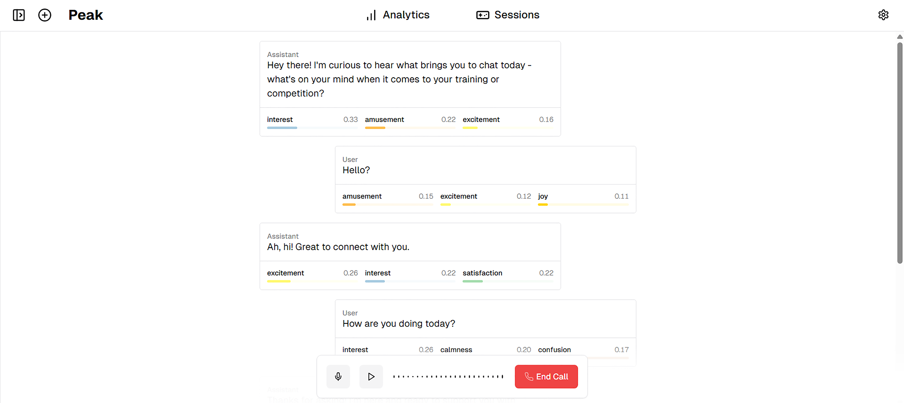
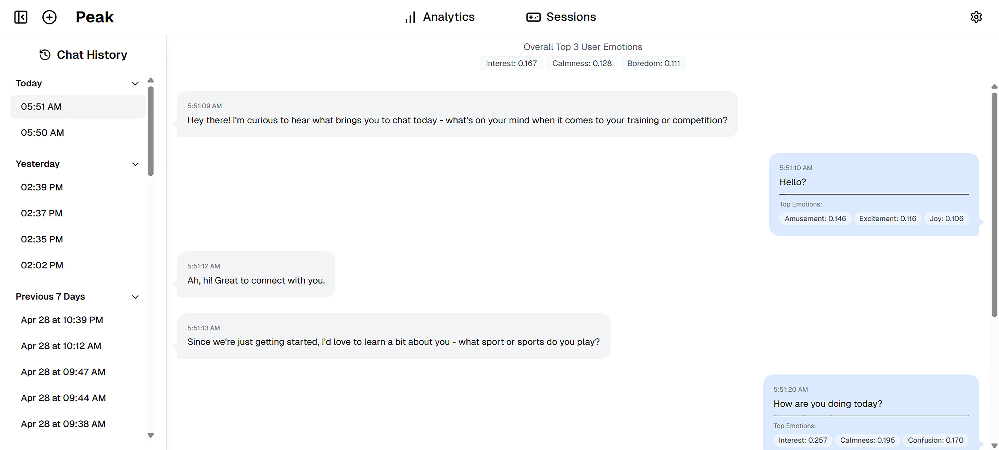
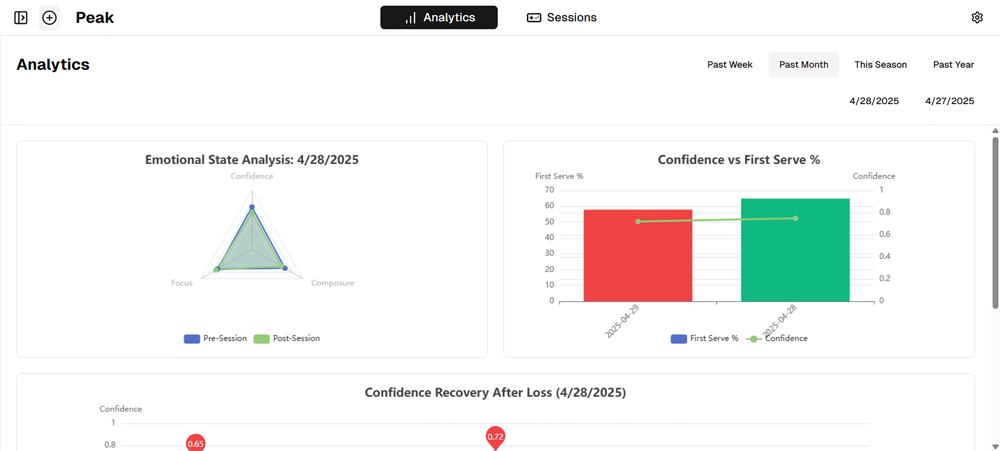
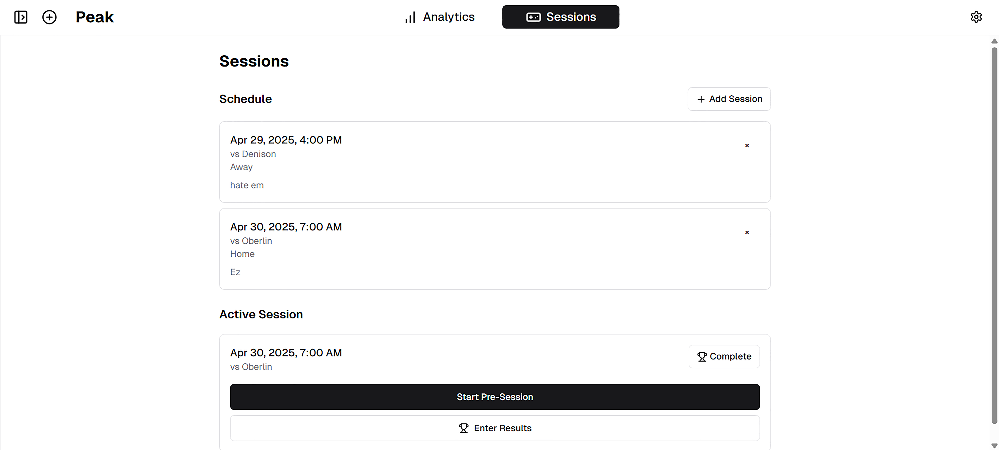

<div align="center">
  <h1>PEAK: Your AI Coach for High-Stakes Performance</h1>
  <p>Originally developed as part of IPHS 484: Senior Seminar under Professor Katherine Elkins at Kenyon College</p>
</div>

## Overview

PEAK is an advanced AI coaching platform designed for high-stakes performers (e.g., athletes, artists, professionals) who need to integrate measurable outputs with subjective mental states. By leveraging real-time emotional data and performance analytics, PEAK provides comprehensive performance analysis with real-time emotional insights via Hume's Empathic Voice Interface (EVI).

### Key Features

- 🎯 Real-time emotional state monitoring during sessions
- 📊 Pre & post-performance emotion tracking
- 💫 Customizable performance metric tracking
- 🔍 User-defined analytical goals
- 📈 Performance-emotion correlation insights
- 🎙️ Seamless voice interaction for reflection & coaching
- 📱 Cross-session pattern analysis
- 🤖 AI-driven personalized feedback



## Technical Implementation

PEAK is built with modern web technologies including:
- Next.js and TypeScript for robust frontend development
- WebSocket connections for real-time data streaming
- Integration with Hume's EVI for voice interaction
- Real-time emotional state analysis during session recording
- Comprehensive analytics post-session

### Core Components

#### Frontend Layer
- Voice Providers: Manages voice interaction & WebSocket connections
- Activity Context: Handles discipline/activity selection and customizable metrics
- Session Manager: Orchestrates performance session flow and customizable metric tracking
- Chat Interface: Real-time voice communication/analysis

#### Analytics Layer
- EmotionRadarChart: Visualizes pre/post emotional states
- EmotionPerformanceChart: Correlates performance with emotional states
- EmotionRecoveryChart: Tracks emotional recovery patterns

#### External Services
- Hume EVI: Provides real-time emotional expression analysis
- WebSocket Integration: Enables real-time voice streaming to EVI

## Data Flow

1. User initiates a session through SessionManager
2. Chat component establishes WebSocket connection for voice interaction
3. Voice data streams to Hume EVI for real-time emotional expression analysis
4. Results are displayed in real-time via UI
5. Post-session analysis correlates performance metrics with emotional states

## Local Development

1. Clone this repository:

   ```shell
   git clone https://github.com/aymanwadud/PEAK 
   ```

2. Install dependencies:

   ```shell
   npm install
   ```

3. Set up your API key and Secret key:

   In order to make an authenticated connection we will first need to generate an access token. Doing so will require your API key and Secret key. These keys can be obtained by logging into the Hume AI Platform and visiting the [API keys page](https://platform.hume.ai/settings/keys). For detailed instructions, see their documentation on [getting your api keys](https://dev.hume.ai/docs/introduction/api-key).

   Place your `HUME_API_KEY` and `HUME_SECRET_KEY` in a `.env` file at the root of your project.

   ```shell
   echo "HUME_API_KEY=your_api_key_here" >> .env
   echo "HUME_SECRET_KEY=your_secret_key_here" >> .env
   ```

4. Specify an EVI configuration (Optional):

   EVI is pre-configured with a set of default values, which are automatically applied if you do not specify a configuration. The default configuration includes a preset voice and language model, but does not include a system prompt or tools. To customize these options, you will need to create and specify your own EVI configuration. To learn more, see their [configuration guide](https://dev.hume.ai/docs/empathic-voice-interface-evi/configuration/build-a-configuration).
   
   ```shell
   echo "NEXT_PUBLIC_HUME_EVI_CONFIG_ID" >> .env
   ```

5. Run the project:
   ```shell
   npm run dev
   ```

6. Access the application at http://localhost:3000

## Features Guide

### Chat History

The application includes a comprehensive chat history feature that allows you to:

- View past conversations in a side panel
- See detailed emotion analysis for each user message
- Track emotion trends across conversations
- View timestamps for each message
- Navigate between different chat sessions

### Emotion Analysis

Each user message in the chat history includes:

- Top 3 detected emotions with scores
- Visual indicators for emotion intensity
- Overall emotion trends for the entire conversation

### UI/UX Features

- Responsive chat interface
- Dark/light mode support
- Real-time voice visualization
- Message bubbles with clear user/assistant distinction
- Easy navigation between live chat and history

## Technologies Used

- Next.js 14 with App Router
- React 18
- TailwindCSS for styling
- Hume AI Voice SDK
- Framer Motion for animations
- TypeScript for type safety

## Future Work & Ethics

- Developing ML models to forecast performance shifts
- Exploring broader psychological insights
- Conducting formal usability testing & efficacy studies
- Ensuring ethical data privacy & user transparency
- Investigating anonymized team insights

## Acknowledgments

Special thanks to Professor Katherine Elkins and the IPHS department at Kenyon College for their guidance on this project.
